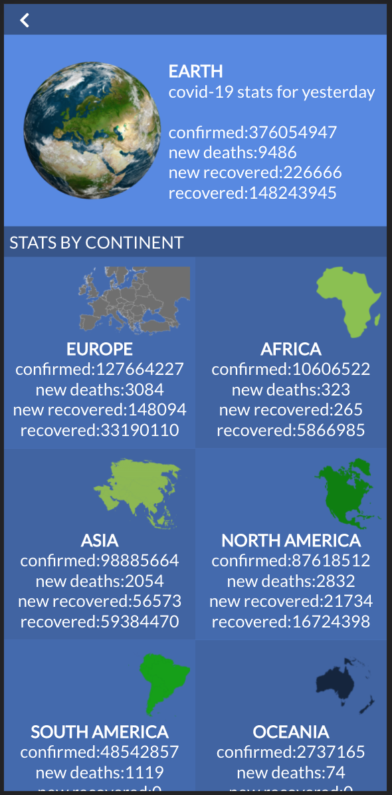
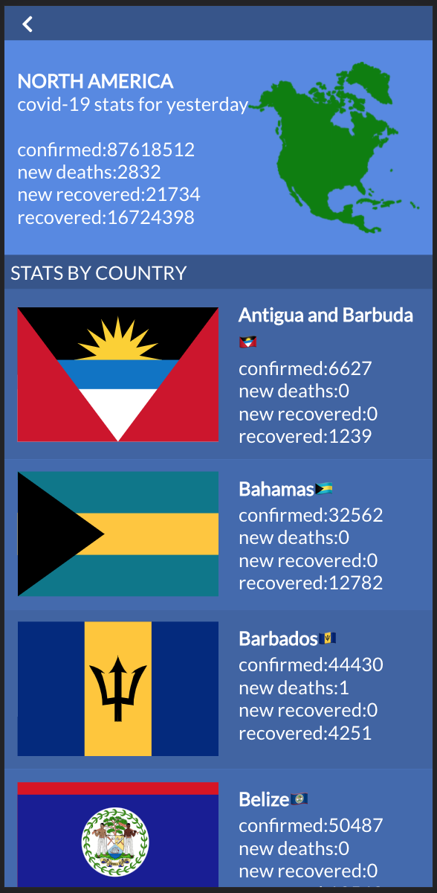
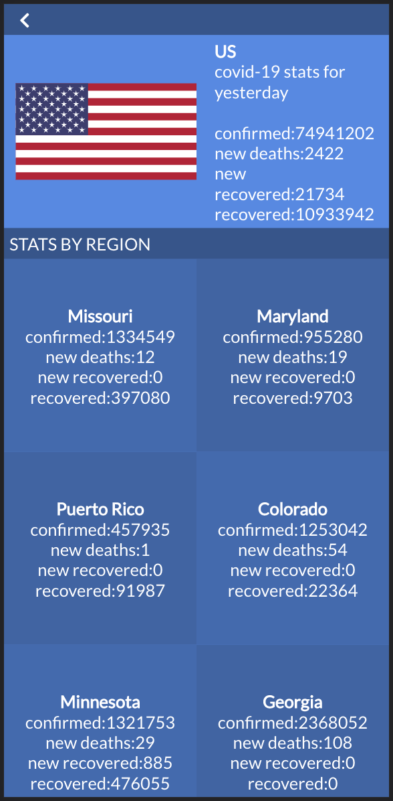

## COVID 19 STATS

> This is a capstone project, it is working with the real live data from the Narrativa API (COVID-19 data) and build a web application for a company that displays COVID-19 data for the previous day.

### Earth
 >
### Continent
 >
### Country
 >

## Live Demo

[Netlify](https://keen-wright-b70cfc.netlify.app/)

## Built With

- HTML
- CSS 
- JavaScript 
- React
- Redux

## Getting Started

To get a local copy up and running follow these simple example steps.

### Prerequisites

- Node and NPM
- Web browser (Google chrome)
- Code Editor (VSCode)

### Development (Running locally)

- git clone the project

```bash 
git clone git@github.com:akucintavalent/covid-19-stats
```

- Install Dependencies

```bash
npm install
```

- To run StyleLint by itself, you may run the lint task:

```bash
npx stylelint "**/*.{css,scss}"
```

- Automatically fix issues found (where possible):

```bash
npx stylelint "**/*.{css,scss}" --fix
```
- To fix automatically javaScript issues found
```bash
npx eslint . --fix
```

- Finally, start your development server by running:

```bash
npm start
```

👤 **Bohdan Shcherbak**

- [GitHub](https://github.com/akucintavalent)
- [Twitter](https://twitter.com/ibodi828)
- [LinkedIn](https://www.linkedin.com/in/bohdan-shcherbak/)

## 🤝 Contributing

Contributions, issues and feature requests are welcome!

Feel free to check the [issues page](https://github.com/akucintavalent/covid-19-stats/issues).

## Show your support

Give a ⭐️ if you like this project!

## Acknowledgments

- React Community 
- Microverse
- Special thanks to [Nelson Sakwa](https://www.behance.net/sakwadesignstudio), the [author of the original design](https://www.behance.net/gallery/31579789/Ballhead-App-(Free-PSDs)).

## 📝 License

[MIT licensed]().
